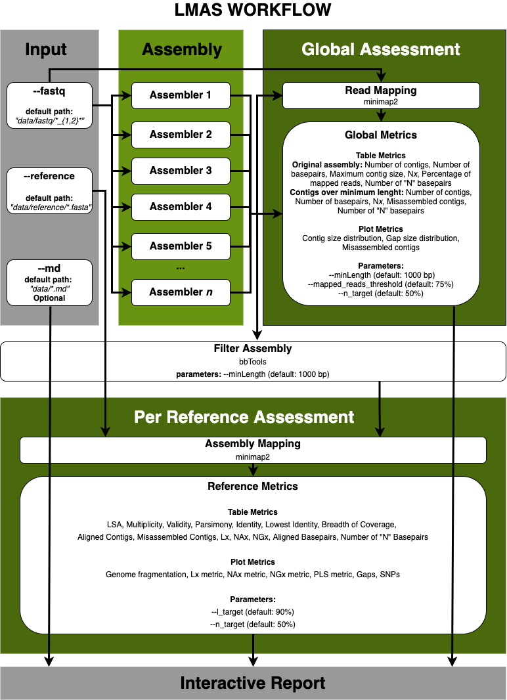

General Orientation
===================

LMAS code is in two repositories: `source repository <https://github.com/B-UMMI/LMAS>`_ and 
`report repository <https://github.com/cimendes/lmas_report>`_. 

LMAS repository
----------------

This repository contains the code for LMAS workflow. The workflow is developed in `Nextflow <https://www.nextflow.io/>`_ DSL2.
The **main file** is `main.nf <https://github.com/B-UMMI/LMAS/blob/main/main.nf>`_, to be executed by Nextflow.
A wrapper file `LMAS` is provided for running the workflow. If no options are provided it will output LMAS help information on how
to use the workflow, otherwise it will call `nextflow` with the main file. 

Configuration
::::::::::::::

The **main configuration** file is `nextflow.config <https://github.com/B-UMMI/LMAS/blob/main/nextflow.config>`_ and contains
the main configuration parameters for the execution of LMAS. The **parameters, containers and resources** configuration files,
located in the `conf` directory, that can be altered by the user to adapt LMAS execution. A detailed description is available in
the  `User guide <../user/basic_usage.html>`_. 

Information on how to costumize these values is available `here <../user/parameters.html>`_.

Modules
::::::::::

LMAS is split into 5 modules that are run in the main workflow and are responsible for preprocessing the input data,
assemble the data in parallel, compute all the global and reference-dependent metrics and compile the final report.
LMAS modularity, thanks to its implementation in DSL2, facilitates the maintenance and future updates. These modules are 
located in the `modules <https://github.com/B-UMMI/LMAS/tree/main/modules>`_ folder. 

Templates
::::::::::

The `templates <https://github.com/B-UMMI/LMAS/tree/main/templates>`_ folder contains the custom python scripts used
by LMAS to process the data and compute the evaluation metrics, and are called in the 
`LMAS.nf <https://github.com/B-UMMI/LMAS/blob/main/LMAS.nf>`_ file. 

Resources
:::::::::

The `resources <https://github.com/B-UMMI/LMAS/tree/main/resources>`_ folder contains the compiled source code 
for the LMAS report. The report code is available in the `report repository <https://github.com/cimendes/lmas_report>`_.

Lib
::::

The `lib <https://github.com/B-UMMI/LMAS/tree/main/lib>`_ folder contains custom Groovy code used by LMAS for 
the ``--help`` function and parameter validation. 

Docker
::::::

The dockerfile for the main LMAS container, including all necessary python dependencies for the custom code in the 
`templates <https://github.com/B-UMMI/LMAS/tree/main/templates>`_  is available in the 
`docker folder <https://github.com/B-UMMI/LMAS/tree/main/docker/LMAS>`_. Additionally, the docker files used to 
build all the container for all assemblers in LMAS are also available in the `docker` folder.

LMAS report
-------------

This `repository <https://github.com/cimendes/lmas_report>`_. contains the source code for the interactive report that 
comes pre-packaged with LMAS.
This project uses ``npx webpack`` to compile a standalone ``main.js`` file that is integrated into LMAS.
The necessary dependencies for the project are provided in the ``environment.yml`` file available in this repo.

