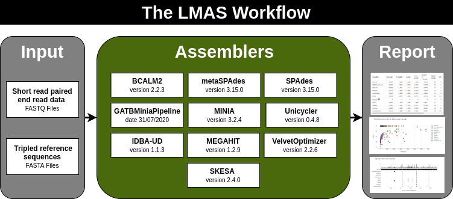

Overview
========

The *de novo* assembly of raw sequence data is a **key process** when analysing data from shotgun metagenomic sequencing. 
It allows recovering draft genomes from a pool of mixed raw reads, yielding longer sequences that offer contextual 
information and afford a more complete picture of the microbial community. **It also represents one of the greatest** 
**bottlenecks when obtaining trustworthy, reproducible results**.

**LMAS** is an **automated workflow enabling the benchmarking** of traditional and metagenomic
prokaryotic *de novo* **assembly software using defined mock communities**. The results are presented in an **interactive** 
**HTML report** where selected global and reference specific performance metrics can be explored.

LMAS expects **reference sequences in tripled version** as to to ensure that contigs can fully align even with 
start-end overlap and regardless of their starting position relative to that of the linearised reference sequence. 
**Read data in paired-end form** is required to be passed on for the assembler.

The mock communities can be provided by the user to better reflect the samples of interest. New assemblers can 
be added with minimal changes to the pipeline, so that LMAS can be expanded as novel algorithms are developed.

.. _fig-lmas-overviewt:

  
   **The LMAS Workflow**. The input sequencing data is assembled in parallel, resources permitting, by the set of 
   assemblers in LMAS. The resulting assembled sequences are processed and assembly quality metrics are computed,
   both globaly and in comparison to the tripled reference sequences provided. The global and per reference metrics
   are grouped in the LMAS report for exploration
