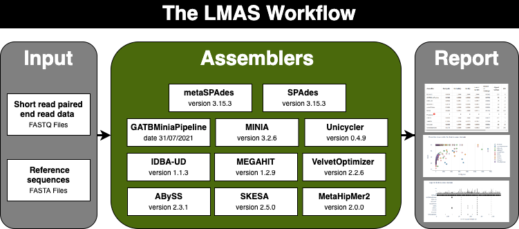

Overview
========

The *de novo* assembly of raw sequence data is a **key process** when analysing data from shotgun metagenomic sequencing. 
It allows recovering draft genomes from a pool of mixed raw reads, yielding longer sequences that offer contextual genomic 
information and afford a more complete picture of the microbial community. **It may also represent one of the greatest** 
**bottlenecks when obtaining trustworthy, reproducible results**.

**LMAS** is an **automated workflow enabling the benchmarking** of traditional and metagenomic
prokaryotic *de novo* **assembly software using defined mock communities**. The results are presented in an **interactive** 
**HTML report** where selected global and reference specific performance metrics can be explored.

LMAS requires as inputs the **reference sequences** (complete genomes) and **short-read paired-end raw data**. 
This raw data can be either obtained *in silico* by creating simulated reads from the reference complete genomes 
or from directly sequencing the references. 
Optionally, information can be passed, in markdown, on the input samples to be presented in the report.
All complete genomes (reference linear replicons) should be provided in a single file. 

**The LMAS Workflow**. The input sequencing data is assembled in parallel, resources permitting, by the set of 
assemblers in LMAS. The resulting assembled sequences are processed and assembly quality metrics are computed,
both globally and in comparison to the reference sequences provided. The global and per reference metrics
are grouped in the LMAS report for interactive exploration.

Implementation
--------------

LMAS was implemented in `Nextflow <https://www.nextflow.io/>`_ to provide flexibility and ensure the transparency 
and reproducibility of the results. LMAS relies on the use of `Docker <https://www.docker.com/>`_ containers for each 
assembler, allowing versions to be tracked easily.

`Nextflow <https://www.nextflow.io/>`_, a workflow management software, allows the effortless 
deployment of LMAS in any UNIX-based system, from local machines to high-performance computing clusters (HPCs) with 
a **container engine installation**, such as `Docker <https://www.docker.com/>`_, `Shifter <https://github.com/NERSC/shifter/>`_ 
or `Singularity <https://singularity.hpcng.org/>`_.

The **local installation of the LMAS workflow**, including the Docker containers, requires 7.3 gigabytes (GB) 
of free disk space. The **default requirements to execute the workflow** are at least 32 GB of memory and 8 CPUs, with 
a maximum of 100 GB of memory and 32 CPU. This can be easily adjusted but might compromise the performance of the 
assemblers contained in LMAS. The assemblers can be skipped individually through the use of parameters. 
The disk space required for execution depends greatly on the size of the input data but, in average, LMAS generates 
approximately 17 GB of data per GB of input data.
