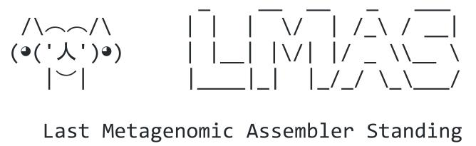

.. LMAS documentation master file, created by
   sphinx-quickstart on Mon Mar  8 16:23:24 2021.
   You can adapt this file completely to your liking, but it should at least
   contain the root `toctree` directive.

LMAS's
======

**Short-read (meta)genomic assembly: finding the best fit in a world of options.**

This is the documentation for LMAS, an automated workflow enabling the benchmarking of traditional and 
metagenomic prokaryotic *de novo* assembly software using defined mock communities. 
The results are presented in an interactive HTML report where selected global and reference specific performance metrics can be explored.

In its current form, **10 assemblers** are implemented in LMAS, with several steps having been 
implemented to ensure the transparency and reproducibility of the results with the use of *Nextflow* and *container software*.

LMAS is open source and available at https://github.com/cimendes/LMAS 

.. _Getting Started:

.. toctree::
   :maxdepth: 1
   :caption: Getting Started

   getting_started/overview
   getting_started/installation
   about/about

.. _User Guide:

.. toctree::
   :maxdepth: 1
   :caption: User Guide

   user/basic_usage
   user/output
   user/assemblers
   user/parameters
   user/metrics

.. _Report:

.. toctree::
   :maxdepth: 1
   :caption: Report

   report/overview
   report/global
   report/reference

.. _Dev:

.. toctree::
   :maxdepth: 1
   :caption: Developer Guide

   dev/general
   dev/add_process
   dev/create_mock_community