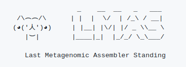

.. LMAS documentation master file, created by
   sphinx-quickstart on Mon Mar  8 16:23:24 2021.
   You can adapt this file completely to your liking, but it should at least
   contain the root `toctree` directive.

LMAS's
======

Short-read metagenomic assembly: finding the best fit in a world of options.

.. _Getting Started:

.. toctree::
   :maxdepth: 1
   :caption: Getting Started

   getting_started/overview
   getting_started/installation
   about/about

.. _User Guide:

.. toctree::
   :maxdepth: 1
   :caption: User Guide

   user/basic_usage

