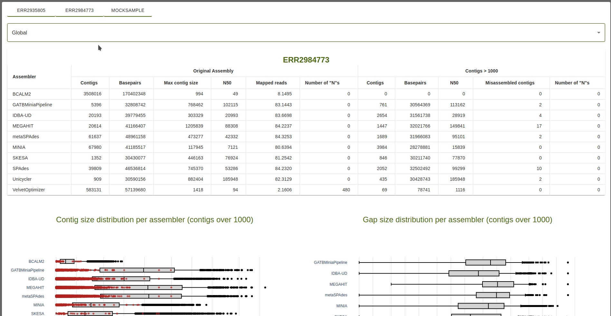
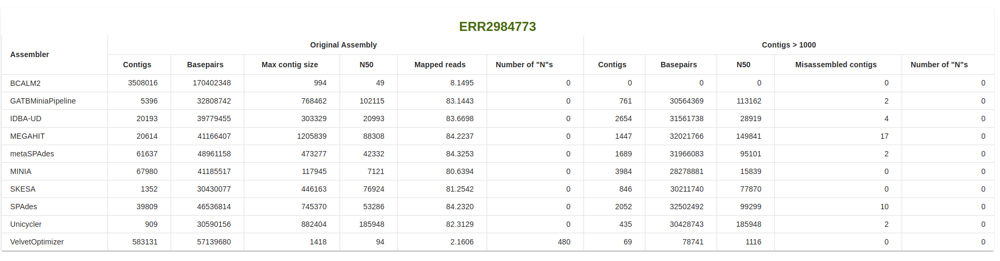
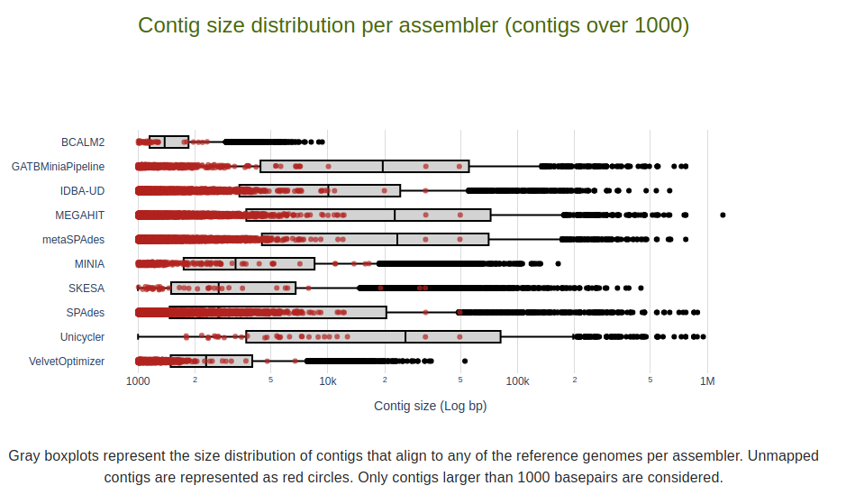
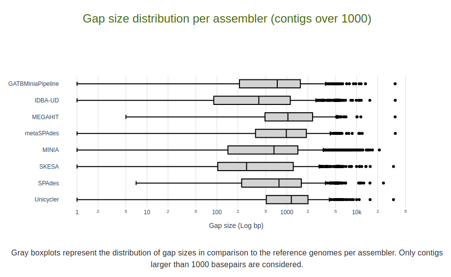
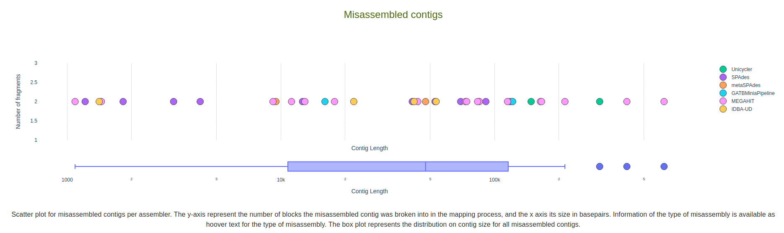

Global Assembly Metrics
=======================

The global metrics can be accessed for each sample in the dropdown menu. This is the option shown in the report by default. 

Table of Metrics
----------------

The global table is devided into two sections: **Original Assembly** and **Contigs > X**. 
The minimum contig size as defined in the ``--minLength`` parameter. The same metrics are presented for **both sections** 
per assembler: *Contigs*, *Basepairs*, *Nx* and *Number of "N"s*. Target value for the *Nx* metric is defined by the
``--n_target`` parameter (defaul: ``0.5``). The exceptions are *Max contig size* and *Mapped reads*, 
shown for the **Original Assembly**, and **Misassembled contigs** shown for the **Contigs > X** section.

Metric definitions are available when mousehover the column titles or, alternatively, in the 
`Metrics section <../user/metrics.rst>`_ of this documentation.

Global Plots
-------------

The following plots are displayed for the global assembly metrics: *Contig size distripution per assembler*, *Gap size distribution
per assembler* and *Misassembled contigs*. These metrics are calculated for the contigs over *x* basepairs in size, as defined
by the minimum contig size in the ``--minLength`` parameter.

Contig size distripution per assembler
::::::::::::::::::::::::::::::::::::::

For each assembler in LMAS, a gray boxplot is created representing the **size distribution of contigs** that align to any of the 
reference genomes. In each boxplot, the *ends of the box* represent the **lower and upper quartiles**, while the **median** 
(second quartile) is marked by a line inside the box. **Outliers** are shown as back dots. 

Unmapped contigs are represented as red circles. Size is contigs, in basepairs, is available as hoover text. 

Only contigs larger than *x* basepairs are considered, as defined by the minimum contig size in the ``--minLength`` parameter.

Gap size distripution per assembler
:::::::::::::::::::::::::::::::::::

Similar to the *Contig size distripution per assembler* plot, the *gap size distribution* for each assembler 
is represented as a gray boxplot. In each boxplot, the *ends of the box* represent the **lower and upper quartiles**, while the **median** 
(second quartile) is marked by a line inside the box. **Outliers** are shown as back dots. 

Misassembed contigs
:::::::::::::::::::

This is a combination plot of the misassembled contigs per assembler and their size distribution, per assembler. 
The **top plot** contains a *scatter plot* of the misassembed contigs. The y-axis represent the number of blocks the 
misassembled contig was broken into in the mapping process. The x-axis its size in basepairs. 
Information of the type of misassembly is available as hoover text for the type of misassembly: *insertion*, *inversion*,
*missense*, *chimera*, *translocation*. 

The **bottom plot** box plot represents the distribution on contig size for all misassembled contigs. The *ends of the box* 
represent the **lower and upper quartiles**, while the **median** (second quartile) is marked by a line inside the box. 
**Outliers** are shown as circles. 

