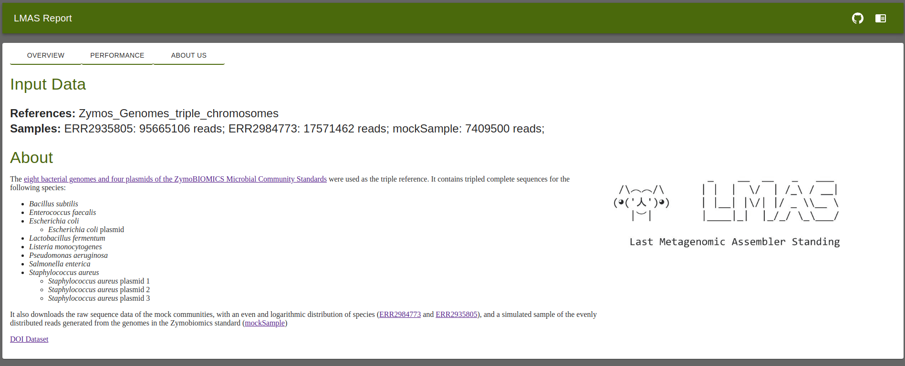

Overview
========

LMAS creates an interactive HTML report, stored in the ``report/`` folder in the directory where the workflow was executed. 
To open the report simply click on the ``index.html`` file and the report will open on your default browser.

The JavaScript source code for the interactive report comes bundled with LMAS but is freely available at https://github.com/cimendes/lmas_report. 
It was built with the JavaScript frameworks React (https://reactjs.org/, version 16.8.0) and Material-UI (https://material-ui.com/, version 4.11.00). 
All interactive charts were rendered with the graph visualization library Plotly.js (https://plotly.com/javascript/, version 1.57.1) through its 
React component, react-plotly (https://plotly.com/javascript/react/, version 2.5.0). 

On the top right corner there's a direct link to LMAS `source repository <https://github.com/cimendes/LMAS>`_ and 
`documentation <https://lmas.readthedocs.io/en/latest>`_. 

.. image:: ../resources/report_lmas.gif
    :alt: Report LMAS
    :align: center
    :scale: 70 %

Report Overview
----------------

The top portion of the report contains information on the input samples and overall performance of the assemblers in LMAS.
This is divided into three tabs:
* Overview
* Performance
* About us

Overview
:::::::::

This is divided into two sections: **Input Data** and **About**. 

The Input Data section presents the name of the file passed to the ``--reference`` parameter, the sample names of the short-read paired-end 
raw sequencing files passed to the ``--fastq`` parameter, and the number of reads in each file. 

The About section loads information about the samples used, in markdown, passed on to LMAS with the ``--md`` parameter. This is an 
optional parameter so, if missing, no information will be presented. 

Performance
:::::::::::

This tab has a table with information on version, container used and performance metrics for each assembler in LMAS.

* **Assembler:** Assembler name
* **Version:** Version of the assembler used, obtained through the ``--version`` or ``-v`` flag. If no version is provided, the cell is left blank.
* **Container:** Container used in LMAS for the assemblers.
* **Avg Time:** Average execution time to assemble the input samples. 
* **CPU/Hour:** Average amount of time the CPU was used by the Assembler 
* **Max Memory (GB):** Maximum amount of memory, in Gigabytes, used by the Assembler.
* **Average Read (GB):** Average data read, in Gigabytes, by the Assembler.
* **Average Write (GB):** Average data written, in Gigabytes, by the Assembler.

About Us
::::::::

Contains information of LMAS development team. 

