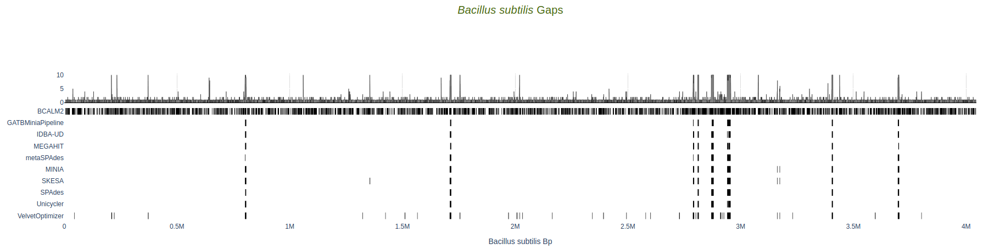

Assembly Metrics per Reference
==============================

The per reference metrics can be accessed for each sample in the dropdown menu. In addition to the *global* metrics, the *name
of each reference* is available in the dropdown.  

Information on the reference is available, including the **name**, **size in basepairs** and **percentage of GC content**.

.. image:: ../resources/report_reference.gif
    :alt: Global Metrics in LMAS report 
    :align: center
    :scale: 70 %

Table of Metrics
----------------

For each assembler, the following metrics are shown in relation to the sequences produced by the assembler that 
aligned to the reference sequence: *Contiguity*, *Multiplicity*, *Validity*, *Parsimony*, *Identity*, *Lowest identity*,
*Breath of coverage*, *Align contigs*, *Misassembled contigs*, *Lx*, *NAx*, *NGx*, *Aligned Basepairs* and *Number of "N"s*.
Target value for the *Lx* metric is defined by the``--l_target`` parameter (defaul: ``0.9``).
The target value for the *NAx* and *NGx* metrics is defined by the``--n_target`` parameter (defaul: ``0.5``).

Metric definitions are available when mousehover the column titles or, alternatively, in the 
`Metrics section <../user/metrics.rst>`_ of this documentation.

If any sequences produced by an assembler fail to align to the reference, a red check mark is shown in the table.

Reference Plots
---------------

The following plots are displayed for the assembly metrics per reference: *Genome fragmentation*, *Lx Metric*, 
*NAx Metric*, *MGx Metric*, *PLS Metric*, *Gaps* and *SNPs*. 
These metrics are calculated for the contigs over *x* basepairs in size, as defined by the minimum contig size 
in the ``--minLength`` parameter, that map to the reference sequence. 

Genome fragmentation
::::::::::::::::::::

**Number of contigs** (x-axis) per **breath of coverage** (y-axis) per assembler for the reference sequence. 
Data for assemblers who fail to produce sequences that align to the reference sequence aren't shown.

Lx Metric
:::::::::

Minimal number of contigs that align to the reference sequence that cover *x* percent of the 
sequence of the reference, ranging from 0 to 100, per assembler.
Data for assemblers who fail to produce sequences that align to the reference aren't present.
The dashed vertical line represents the target value defined in the ``--l_target`` parameter.

NAx Metric
::::::::::

Length for which the collection of all aligned contigs of that length or longer covers at least *x* percent of 
the total length of the aligned assembled contigs, ranging from 0 to 100, per assembler.
Data for assemblers who fail to produce sequences that align to the reference aren't present.
The dashed vertical line represents the target value defined in the ``--n_target`` parameter.

NGx Metric
::::::::::

Length for which the collection of all aligned contigs of that length or longer covers at least *x* percentage 
of the sequence of the reference, ranging from 0 to 100, per assembler. 
Data for assemblers who fail to produce sequences that align to the reference aren't present.
The dashed vertical line represents the target value defined in the ``--n_target`` parameter.

PLS
:::

Phred-like score per contig, per assembler. 
Data for assemblers who fail to produce sequences that align to the reference aren't present.

Gaps
::::

Location of gaps in comparison to the reference sequence, per assembler. Length of gap, in basepairs, is available as hoover text. 
The **top plot** represents the histogram of the cumulative number of gaps per position in the reference. 

Data for assemblers who fail to produce sequences that align to the reference aren't present.

SNPs
::::

Location of substitutions in comparison to the reference sequence, per assembler. Substitution type and coordenate is available 
as hoover text.
The **top plot** represents the histogram of the cumulative number of substitutions per position in the reference. 

Data for assemblers who fail to produce sequences that align to the reference aren't present.

