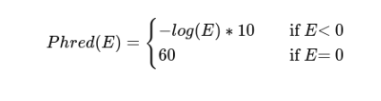

Metrics
=======

Global Metrics
--------------

Global Table Metrics
^^^^^^^^^^^^^^^^^^^^^

Global table metrics are presented both for the **Original Assembly** and in the **Filtered Assembly**.
Assemblies are filtered by a minumum contig size, defined in the ``--minLength`` parameter. 

Contigs
"""""""
* Total number of contigs in an assembly;
* Calculated for the **Original Assembly** and the **Filtered Assembly**, by minimum contig size as defined in the ``--minLength`` parameter; 

Basepairs
"""""""""
* Total number of basepairs in an assembly;
* Calculated for the **Original Assembly** and the **Filtered Assembly**, by minimum contig size as defined in the ``--minLength`` parameter;

Maximum Contig Size
"""""""""""""""""""
* Lenght, in basepairs, of the largest contig in an assembly;
* Calculated for the **Original Assembly**.

Nx
"""
* Length for which the collection of all contigs of that length or longer in an assembly covers at least *x* % of the total length of the assembled contigs;
* Calculated for the **Original Assembly** and the **Filtered Assembly**, by minimum contig size as defined in the ``--minLength`` parameter; 
* **Default target value:** 50 %

Mapped Reads
""""""""""""
* Percentage of mapped reads to an assembly;
* A read is considered mapped if at least *x* % of the read sequence aligns to a contig in the assembly, as defined in the ``--mapped_reads_threshold`` parameter;
* Calculated for the **Original Assembly**.
* **Default threshold:** 0.75 %

Number of 'N's
""""""""""""""
* Total of 'N's in assembly basepairs;
* Calculated for the **Original Assembly** and the**Filtered Assembly**, by minimum contig size as defined in the ``--minLength`` parameter;

Missassembled Contigs
"""""""""""""""""""""
* Number of missassembled contigs;
* Calculated for the **Filtered Assembly**, by minimum contig size as defined in the ``--minLength`` parameter;

Global Plot Metrics
^^^^^^^^^^^^^^^^^^^^
Global plot metrics are presented for the **Filtered Assembly**.
Assemblies are filtered by a minumum contig size, defined in the ``--minLength`` parameter. 

Contig size distribution per assembler
"""""""""""""""""""""""""""""""""""""""

This plot contains a **boxplot** for each assembler representing the size distribution of contigs that align to any of the reference genomes.
Unmapped contigs are represented in a **scatter plot** as red circles. 

Gap size distribution per assembler
""""""""""""""""""""""""""""""""""""

This plot contains a **boxplot** for each assembler representing the distribution of gap sizes in comparison to the reference genomes.

Misassembled contigs
""""""""""""""""""""

This plot contains a **scatter plot** for misassembled contigs per assembler. The *y-axis* represent the number of blocks the misassembled 
contig was broken into in the mapping process, and the *x-axis* its size in basepairs. 
Information of the **type of misassembly** is available as hoover text for the type of misassembly. 

Types of misassembly detected:
* Inversion
* Insertion
* Deletion
* Translocation
* Misense
* Chimera

Additionally, a **boxplot** representing the contig size distribution for all misassembled contigs is available.

Per Reference Metrics
---------------------

Metrics per reference are calculated with ``minimap2`` mapping results between the the **Filtered Assembly** and the **tripled reference sequences**.
Assemblies are filtered by a minumum contig size, defined in the ``--minLength`` parameter. 

Reference Table Metrics
^^^^^^^^^^^^^^^^^^^^^^^^^

Contiguity
""""""""""
* Longest single alignment between the assembly and the reference, relative to the reference length;
* Implemented as defined by `Wick & Holt, 2021 <https://doi.org/10.12688/f1000research.21782.4>`_.

Multiplicity
""""""""""""
* Ratio of the length of alignable assembled sequence to covered sequence on the reference;
* Implemented as defined by `Bradnam et al, 2013 <https://doi.org/10.1186/2047-217X-2-10>`_.

Validity
"""""""""
* Ratio of the length of alignable assembled sequence to total basepairs in the aligned contings;
* Implemented as defined by `Bradnam et al, 2013 <https://doi.org/10.1186/2047-217X-2-10>`_.

Parsimony
"""""""""
* Cost of the assembly (multiplicity over validity);
* How many bases of assembled sequence need to be inspected, in order to find one base of real, validatable sequence;
* Implemented as defined by `Bradnam et al, 2013 <https://doi.org/10.1186/2047-217X-2-10>`_.

Identity
"""""""""
* Ratio of identical basepairs in all aligned contigs to the reference.

Lowest Identity
"""""""""""""""
* Identity of the lowest scoring contig to the reference.

Breadth of Coverage
"""""""""""""""""""
* Ratio of covered sequence on the reference by aligned contigs;
* Implemented as defined by `Bradnam et al, 2013 <https://doi.org/10.1186/2047-217X-2-10>`_.

Aligned Contigs
"""""""""""""""
* Number of aligned contigs to the reference.

Missassembled Contigs
"""""""""""""""""""""
* Number of aligned contigs with misassemblies.

Lx
"""
* Minimal number of contigs that cover *x* % of the sequence of the reference;
* Implemented as defined by `Gurevich et al, 2013 <https://dx.doi.org/10.1093%2Fbioinformatics%2Fbtt086>`_;
* **Default target:** 90 %

NAx
"""
* Length for which the collection of all aligned contigs of that length or longer covers at least *x* % of the total length of the aligned assembled contigs;
* Implemented as defined by `Gurevich et al, 2013 <https://dx.doi.org/10.1093%2Fbioinformatics%2Fbtt086>`_;
* **Default target:** 50 %

NGx
"""
* Length for which the collection of all aligned contigs of that length or longer covers at least *x* % of the sequence of the reference.
* Implemented as defined by `Gurevich et al, 2013 <https://dx.doi.org/10.1093%2Fbioinformatics%2Fbtt086>`_;
* **Default target:** 50 %

Aligned Basepairs
"""""""""""""""""
* Total basepairs aligned to to the reference.

Number of 'N'
"""""""""""""
* Total of 'N' basepairs in the contigs aligned to to the reference.

Reference Plot Metrics
^^^^^^^^^^^^^^^^^^^^^^^

Genome Fragmentation
""""""""""""""""""""

**Scatter plot** representing the *number of contigs* (x-axis) per *breath of coverage* (y-axis) of the reference per assembler.
Data for assemblers who fail to produce sequences that align to the reference aren't present.

Lx Metric
""""""""""
**Line plot** for minimal number of contigs (L Metric) that cover the sequence of the reference, from 0 to 100%.

NAx Metric
"""""""""""
**Line plot** the length for which the collection of all aligned contigs of that length or longer covers at least 
*x* % of the total length of the aligned assembled contigs (NA Metric), from 0 to 100%.

NGx Metric
"""""""""""
**Line plot** for the length for which the collection of all aligned contigs of that length or longer covers at least 
*x* % of the sequence of the reference (NG metric), from 0 to 100%.

PLS Metric
"""""""""""
**Scatter plot** for the Phred-like score (PLS) per contig, per assembler. 
Data for assemblers who fail to produce sequences that align to the reference aren't present.

The Phred-like score for each contig is obtained as following:

Gaps
""""
Location of **gaps** in comparison to the reference sequence, per assembler. Length of gap, in basepairs, and coordenates in the reference
is available as hoover text. 
The **histogram** of the cumulative number of gaps per position in the reference is avaiable above the gap location plot. 
Data for assemblers who fail to produce sequences that align to the reference aren't present.

SNPs
""""
Location of **substitutions** in comparison to the reference sequence, per assembler. Substitution type and coordenate in the reference 
is available as hoover text.
The **histogram** of the cumulative number of substitutions per position in the referenceis is avaiable above the SNP location plot. 
Data for assemblers who fail to produce sequences that align to the reference aren't present.
